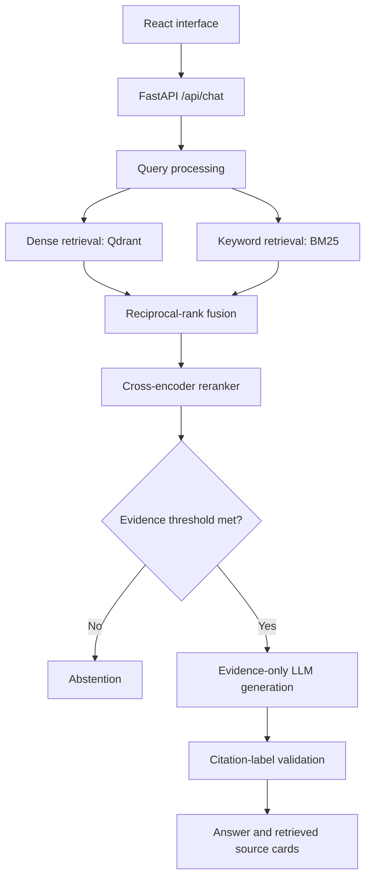
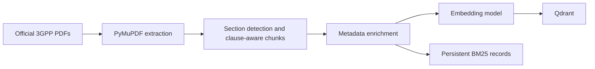

# Architecture

## Query path

## Ingestion path

### Design choices

- Each chunk carries the source filename, detected specification/release, section, section title, and page number.
- Dense and sparse results use reciprocal-rank fusion, avoiding arbitrary score-scale comparisons.
- A cross-encoder scores query/evidence pairs before the evidence threshold decides whether answering is allowed.
- The LLM receives only accepted evidence and must use `[S#]` labels. Labels outside the retrieved set cause an abstention instead of an unsupported answer.
- This is a risk-reduction system, not a claim of mathematically guaranteed zero hallucinations.
